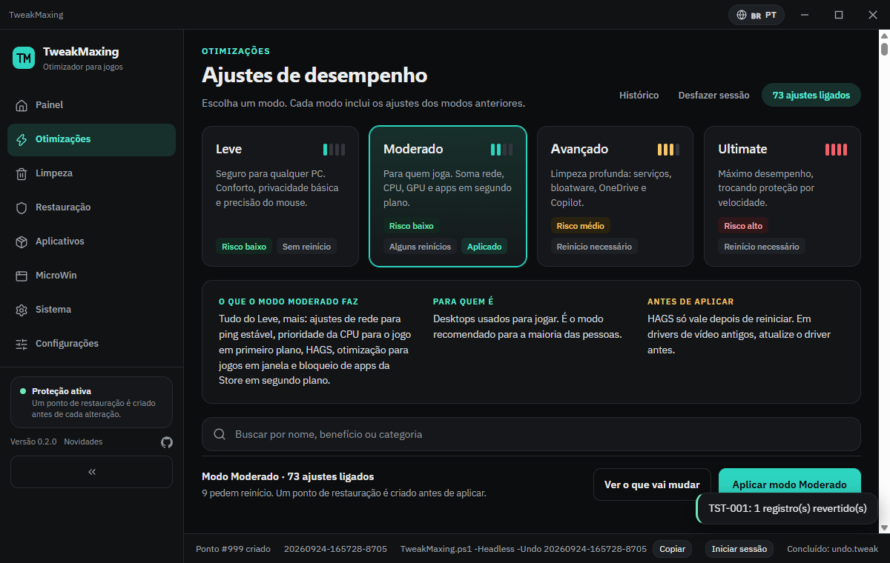
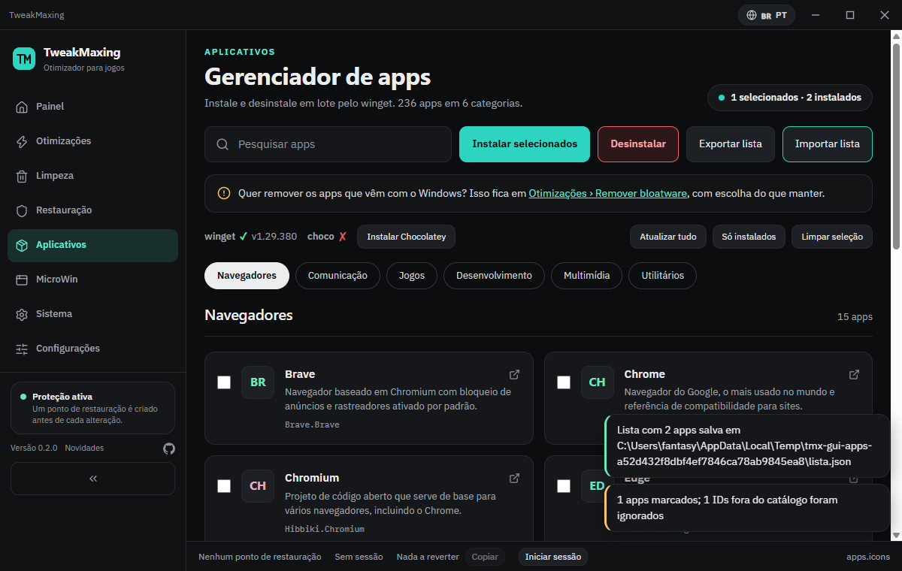
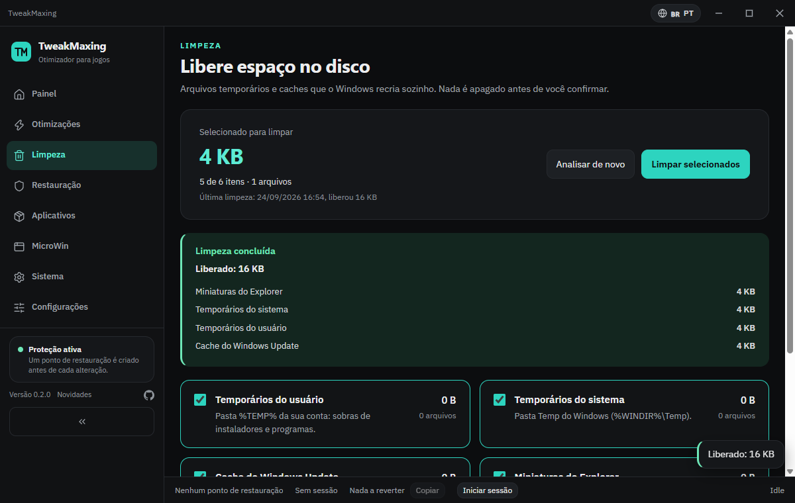
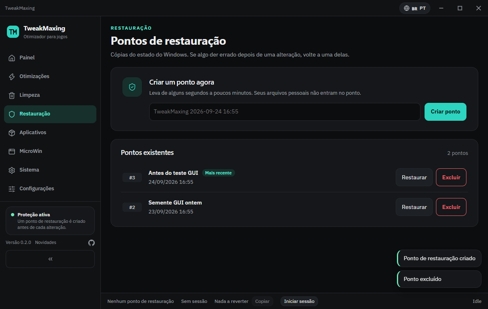
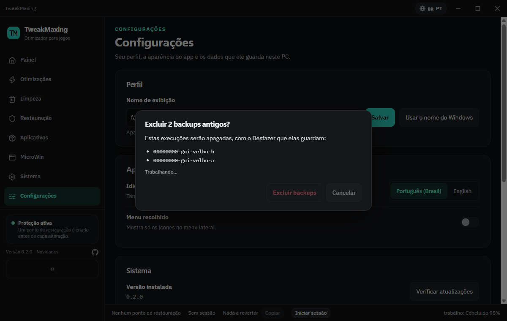

# TweakMaxing

Utilitário de otimização e manutenção do Windows 10/11, em português, com interface gráfica e um único comando para abrir.

**Obra derivada do [WinUtil](https://github.com/ChrisTitusTech/winutil)** (Chris Titus Tech, licença MIT) — não afiliado. Catálogos, arquitetura de compilação e várias funções vêm de lá; veja `LICENSE` e `THIRD-PARTY-NOTICES.md`. Nome, marca e visual são próprios.

## Novidades da 2.0

- **Interface nova:** barra de título própria, menu lateral com Painel, Otimizações, Limpeza, Restauração, Aplicativos, MicroWin, Sistema e Configurações, e tema escuro com verde-azulado.
- **Português e inglês:** você escolhe na primeira abertura e pode trocar a qualquer hora pela barra de título. A interface e os textos do catálogo têm as duas versões.
- **Painel:** mostra o hardware (CPU, GPU com VRAM, RAM, disco e sistema), o status das otimizações e até três recomendações para este PC.
- **Modos de otimização:** Leve, Moderado, Avançado e Ultimate, cumulativos. Os cards explicam o que cada ajuste faz, o benefício e o ponto de atenção. O Ultimate pede uma confirmação separada.
- **9 ajustes novos**, entre eles DirectX otimizado para jogos em janela, escolha do bloatware que fica e PowerShell 7 como padrão do Terminal.
- **Limpeza** de temporários, cache do Windows Update, miniaturas, Lixeira e prefetch, com medição antes de apagar.
- **Restauração:** lista, cria, exclui e restaura pontos de restauração.
- **Aplicativos** com exportar e importar a seleção e o selo "Instalado". **MicroWin** com layout novo, opções novas e botão de cancelar.
- **Configurações** que ficam salvas, verificação de atualização do próprio app e limpeza de cache e de backups antigos.

## O que muda em relação ao WinUtil

1. **Ponto de restauração obrigatório e bloqueante** antes da primeira alteração da sessão. Se não puder ser criado e verificado, nada é alterado (pular exige digitar uma frase).
2. **Desfazer de verdade.** Cada alteração grava o valor anterior em `state.json` *antes* de escrever, exporta `.reg` das chaves tocadas e pode ser desfeita por item, por sessão ou por execução antiga.
3. **Selo de evidência** em todo item: `MEDIDO` (efeito verificável), `TECNICO` (mecanismo plausível, ganho depende do contexto) ou `FOLCLORE` (sem sustentação — continua no catálogo, mas desmarcado e com aviso). Itens sem reversão possível levam o selo `Irreversível` e exigem confirmação digitada.
4. **Prévia antes de aplicar:** cada ação mostra chave/valor `antes → depois`, lidos ao vivo.

## Como usar

### Rápido

Abra o **PowerShell** (Iniciar → digite `powershell`) e cole:

```powershell
irm "https://tweakmax1ng.vercel.app" | iex
```

Se o terminal não for de administrador, o TweakMaxing pede o UAC sozinho e reabre elevado. O endereço redireciona para o release mais recente em [GitHub Releases](https://github.com/nikemafia044-a11y/tweakmaxing/releases/latest); o processo elevado baixa exatamente a mesma versão que você iniciou.

Com parâmetros (ex.: modo headless):

```powershell
& ([scriptblock]::Create((irm "https://tweakmax1ng.vercel.app"))) -Headless -Preset notebook -DryRun
```

### Verificado (recomendado para auditoria)

Baixa uma versão fixa, confere o SHA256 publicado em `SHA256SUMS.txt` e só então executa:

```powershell
Invoke-WebRequest -Uri https://github.com/nikemafia044-a11y/tweakmaxing/releases/download/v2.0.0/TweakMaxing.ps1 -OutFile TweakMaxing.ps1
Invoke-WebRequest -Uri https://github.com/nikemafia044-a11y/tweakmaxing/releases/download/v2.0.0/SHA256SUMS.txt -OutFile SHA256SUMS.txt
(Get-FileHash .\TweakMaxing.ps1).Hash -eq (Get-Content .\SHA256SUMS.txt).Split(' ')[0]   # tem que imprimir True
powershell -ExecutionPolicy Bypass -File .\TweakMaxing.ps1
```

**Rápido × Verificado:** o comando rápido sempre segue o release mais recente (`latest`); o caminho verificado usa uma tag fixa (`v2.0.0`), então o mesmo link baixa sempre o mesmo artefato, com o mesmo SHA256 — reproduzível e auditável. Apenas HTTPS é usado. O código-fonte é público neste repositório: o artefato é a concatenação verbatim dele, compilada por `Compile.ps1`. A GUI é a tela de consentimento real: nada é aplicado sem prévia (chave/valor antes → depois), confirmação explícita e ponto de restauração criado e verificado antes da primeira alteração da sessão.

### Desfazer

```powershell
.\TweakMaxing.ps1 -Headless -Undo latest                    # desfaz a última execução
.\TweakMaxing.ps1 -Headless -Undo 20260922-120000-1a2b       # desfaz uma execução específica
```

As execuções ficam registradas em `%LOCALAPPDATA%\TweakMaxing\runs`.

### Modo headless

```powershell
.\TweakMaxing.ps1 -Headless -Preset moderado -DryRun -NoElevate  # simula o modo Moderado: não altera nada e não eleva
.\TweakMaxing.ps1 -Headless -Preset leve                         # aplica o modo Leve (eleva sozinho)
.\TweakMaxing.ps1 -Headless -Preset desktop                      # os presets antigos continuam valendo
```

`-Preset` aceita os modos `leve`, `moderado`, `avancado` e `ultimate` (cumulativos) e os presets antigos `desktop`, `notebook` e `minimo`.

### Antivírus e `iex`

Alguns antivírus marcam o padrão `irm ... | iex` como suspeito, mesmo quando o conteúdo é inofensivo — é o padrão em si, não este script, que costuma disparar heurísticas. O caminho **Verificado** acima baixa o arquivo primeiro, confere o SHA256 e só executa depois, o que evita esse alarme.

### Chocolatey

O instalador do Chocolatey só é baixado depois de um consentimento explícito na interface (nada roda em segundo plano sem essa confirmação), é executado num processo separado, e o SHA256 do instalador baixado fica registrado no log para auditoria — a Chocolatey Software não publica um hash fixo esperado para comparar, então esse valor não é um controle de integridade que bloqueia a instalação, é só evidência para investigar depois se algo parecer errado.

### Capturas de tela

| Painel | Otimizações | Aplicativos |
|---|---|---|
|  |  |  |

| Limpeza | Restauração | MicroWin |
|---|---|---|
|  |  |  |

| Sistema | Configurações | Prévia |
|---|---|---|
|  |  |  |

## Rodar a partir do código-fonte

```powershell
git clone https://github.com/ChrisTitusTech/winutil reference/winutil   # referência de estudo (não vai para o repositório)
.\tools\Get-WebView2Sdk.ps1                                              # baixa e confere o SDK do WebView2 em packages\
.\Start-TmxDev.ps1                                                       # abre a GUI direto do fonte (pede elevação)
```

## Compilar

```powershell
.\Compile.ps1                                  # gera TweakMaxing.ps1 (arquivo único, ~3,2 MB)
.\Compile.ps1 -Run                             # gera e executa
.\Compile.ps1 -SkipSdk                         # não baixa o SDK do WebView2 se packages\webview2 faltar
.\Compile.ps1 -Out C:\temp\TweakMaxing.ps1 -Repo usuario/repo
```

O artefato é a concatenação, nesta ordem, de: cabeçalho de licença → `scripts/start.ps1` (com `#{version}`/`#{repo}` substituídos por `VERSION` e pelo arquivo `REPO`) → todo `src/Core`, `src/Engine` e `src/functions/**` na mesma ordem do `Start-TmxDev.ps1` → os JSONs de `src/config` em `$sync.configs['<nome>']` → os arquivos de `src/web` em `$sync.embedded.web` → `tools/microwin/autounattend.template.xml` em `$sync.embedded.microwinTemplate` → as três DLLs do WebView2 em base64 em `$sync.embedded.webview2` → `scripts/main.ps1` (sem o `param()`, que seria erro de sintaxe no meio do script).

Detalhes que importam:

- **Catálogos sem `ConvertTo-Json`**: o texto de cada JSON entra dentro de `@'…'@` com a estrutura original, só com os caracteres acentuados trocados pelo escape `\uXXXX` do próprio JSON, e é parseado em tempo de execução. Se algum ativo tiver uma linha começando com `'@` (que fecharia a here-string), a compilação falha apontando arquivo e linha.
- **ASCII puro e sem BOM**, como os `.ps1` do repositório: a interface e o modelo do MicroWin entram em base64 dos bytes. Assim nenhuma codepage muda o que o parser lê, e o `irm | iex` funciona (um BOM chegaria como U+FEFF e o parser recusaria). A compilação falha se sobrar algum caractere fora do ASCII.
- Em tempo de execução o artefato extrai a interface e o modelo do MicroWin para `%LOCALAPPDATA%\TweakMaxing\ui\<versão>\` e as DLLs para `...\lib\<versão>\` (arquivo de mesmo tamanho é considerado igual e não é reescrito).
- Com `-SkipSdk` e `packages\webview2` ausente o artefato sai **sem** as DLLs: o modo headless continua funcionando, mas a GUI falha com `SDK do WebView2 não encontrado...`.
- No fim a compilação confere o parser (zero erros), o tamanho (< 8 MB) e imprime o SHA256, que também vai para `SHA256SUMS.txt`. `TweakMaxing.ps1` e `SHA256SUMS.txt` não entram no repositório.

## Executar o artefato

```powershell
.\TweakMaxing.ps1                                                  # abre a GUI (pede elevação)
.\TweakMaxing.ps1 -Headless -Preset desktop -DryRun -NoElevate     # simula; não altera nada, não eleva
.\TweakMaxing.ps1 -Headless -Preset desktop                        # aplica (eleva sozinho)
.\TweakMaxing.ps1 -Headless -Undo latest                           # desfaz a última execução
.\TweakMaxing.ps1 -Headless -Undo 20260922-120000-1a2b             # desfaz uma execução específica
```

Códigos de saída: `0` sucesso, `1` falha (preset ausente, plano impossível, algum item falhou), `2` abortado antes de alterar qualquer coisa.

## Testes

```powershell
.\tests\Invoke-Tests.ps1              # Pester (sem elevação; usa HKCU:\Software\TweakMaxing_Tests)
.\tests\Invoke-Tests.ps1 -Tag Rollback
.\tests\Invoke-Tests.ps1 -Tag Compile # compila e roda o artefato num processo separado
.\tests\gui\Test-Shell.ps1            # GUI via agent-browser (CDP)
.\tests\gui\Test-Shell.ps1 -Port 9343 -ScriptPath .\TweakMaxing.ps1   # a mesma GUI, a partir do artefato
```

## Requisitos

- Windows 10 1909+ ou Windows 11, x64
- Windows PowerShell 5.1 (ou PowerShell 7)
- Runtime do WebView2 (já vem com o Windows 11 e com o Edge; o app oferece instalar se faltar)

## Licença

MIT. Veja `LICENSE` (inclui o aviso de copyright do WinUtil) e `THIRD-PARTY-NOTICES.md`.
